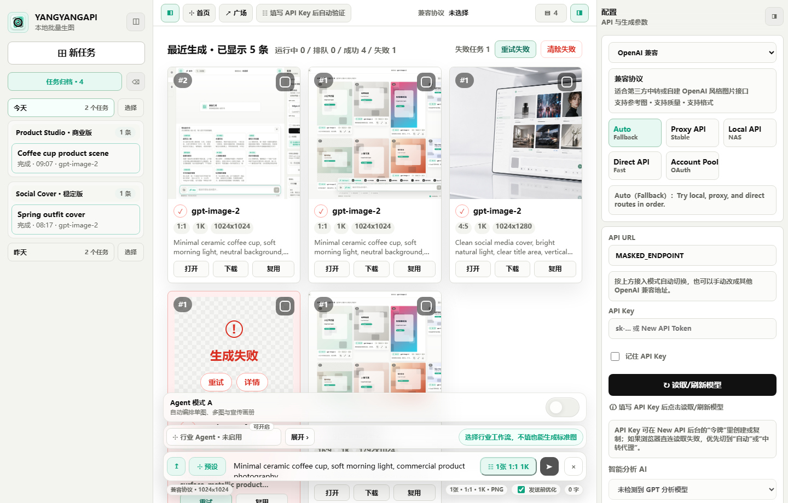
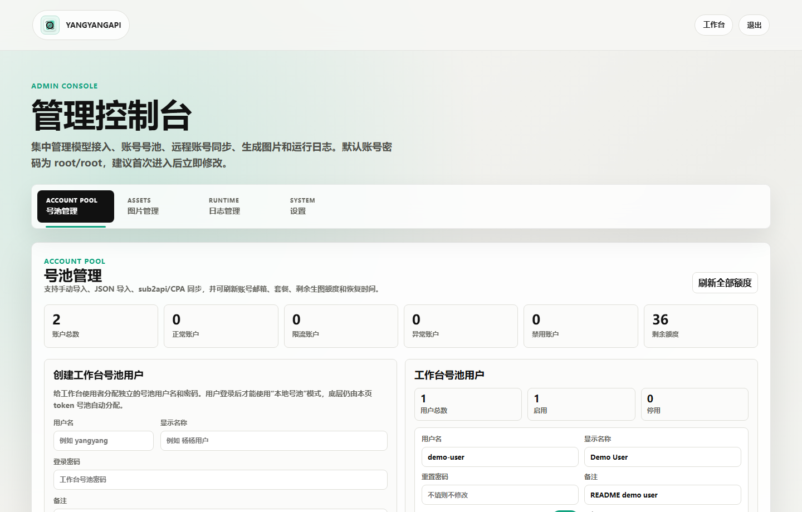
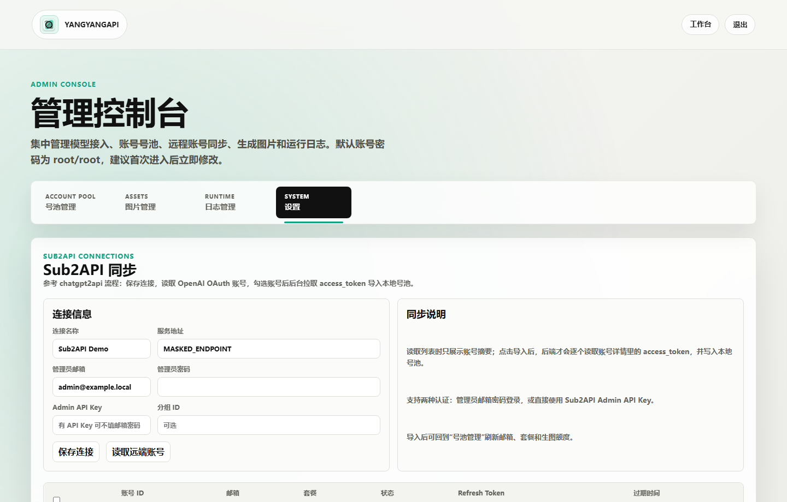

# YANGYANGAPI Image Workspace

YANGYANGAPI Image Workspace 是一个基于 Flask + Docker 的 AI 生图工作站，面向本地 NAS、自建 New API、中转代理和账号号池混合使用场景。它把首页展示、工作台生成、行业 Agent、模型线路配置、账号号池、图片管理和日志管理放在同一个项目里。

演示站点：[YANGYANGAPI 生图工作台](https://yyimage.iepose.cn/#home)

> README 截图使用演示数据，所有真实域名、IP、Token、密码和接口地址均已隐藏。

## 截图








## 功能要求

- 首页：展示工作台能力、智能分析、行业 Agent、广场和本地接入说明。
- 工作台：支持提示词输入、预设提示词、参考图上传、生成参数配置、发送前优化和失败重试。
- 模型接入：支持自动线路、本地接入、中转代理、浏览器直连和本地号池模式。
- 模型读取：填写 API Key 后自动读取可用模型；无生图模型时显示空状态提示。
- 行业 Agent：按行业生成提示词方案，并支持稳定版、创意版、商业版应用到工作台。
- 记录归档：左侧按日期和行业归档任务；中间画布默认展示最近生成的所有图片。
- 图片管理：支持选择、复用、下载、删除、清除失败和重试失败任务。
- 管理后台：支持管理员账号修改、模型描述配置、线路配置、号池用户、账号导入、额度查询、图片管理和日志查看。
- 远程同步：支持 Sub2API 与 CPA 分块配置，同步账号后进入本地号池统一管理。

## 基于 AI 编程的实现思路

这个项目采用“快速对标 + 小步验证”的 AI 编程流程：

1. 先用目标站点拆分页面结构，把首页、工作台、智能分析、行业 Agent、广场和本地接入拆成可独立实现的模块。
2. 再用前端技能约束视觉方向，避免只做功能堆叠，重点保持首屏、工作台和管理后台的一致体验。
3. 后端优先保持简单：Flask 提供页面、状态 API、任务队列、模型读取、账号池和管理接口。
4. 前端把复杂交互放在单个工作台状态流里，统一处理线路选择、模型刷新、任务归档、图片选择和 Agent 状态。
5. 每次修改后用本地预览、语法检查和浏览器截图验证，确认布局、交互和敏感信息显示符合要求。

## 架构

```text
浏览器工作台
  -> Flask Web/API
    -> New API 兼容生图接口
    -> 本地 OAuth 号池
    -> Sub2API / CPA 账号同步
    -> data/ 本地持久化
```

主要目录：

- `app/server.py`：Flask 后端、任务队列、账号池、模型读取和管理接口。
- `app/templates/`：首页、工作台、登录页和管理后台模板。
- `app/static/app.js`：工作台交互、历史归档、模型刷新、Agent、重试和图库操作。
- `app/static/styles.css`：首页、工作台、管理后台的视觉样式。
- `docker-compose.yml`：默认 Docker 部署入口，容器名和镜像名前缀使用 `yangyang-*`。
- `data/`：运行数据目录，不提交到 Git。

## 快速启动

```bash
cp .env.example .env
docker compose up -d --build
```

默认访问端口：`3012`

默认后台账号密码：`root / root`

首次登录后建议在后台“设置”里修改管理员账号密码，并重新配置模型线路和号池用户。

## 配置说明

主要环境变量见 `.env.example`：

- `SECRET_KEY`：Flask session 密钥，生产环境必须改成随机值。
- `NEW_API_BASE`：默认模型接口入口。
- `NEW_API_TOKEN`：可选默认 API Token，也可以在工作台页面填写。
- `DEFAULT_MODEL`：默认生图模型。
- `AVAILABLE_MODELS`：后台初始化时可选模型列表。
- `CONNECTION_LOCAL_URL` / `CONNECTION_PROXY_URL` / `CONNECTION_DIRECT_URL`：本地、代理、直连三类线路。

公开仓库里不要提交真实接口、真实 IP、真实域名、Token、密码和运行数据。

## 使用流程

1. 启动 Docker 服务。
2. 进入管理后台，修改管理员账号密码。
3. 在“设置”里配置模型线路、默认线路顺序和模型描述。
4. 如需本地号池，先在“号池管理”创建工作台号池用户，再导入或同步账号。
5. 回到工作台，选择自动线路或本地号池，读取模型。
6. 输入提示词，选择参数或行业 Agent，提交生成。
7. 在最近记录和生成预览里继续复用、下载、重试或删除图片。

## 安全与数据

- `data/` 保存任务、图片、账号池、后台配置和日志，默认不进入 Git。
- API Key 可选择只在页面临时填写，也可勾选记住到浏览器本地存储。
- 管理后台的线路地址和账号同步信息只应保存在私有部署环境中。
- README 截图为演示数据，不代表真实生产配置。

## 验证

常用检查命令：

```bash
python -m py_compile app/server.py
node --check app/static/app.js
git diff --check
```
